#模块思路分析

## 用户注册
1. 在注册界面输入相关数据  
2. 通过提交按钮，触发注册相关的ajax函数获取当前页面的数据   
3. 通过post方法，在注册页面的路由下，调用addUser()函数，把新注册的用户信息存入User集合中。   
4. 跳转到登录界面  

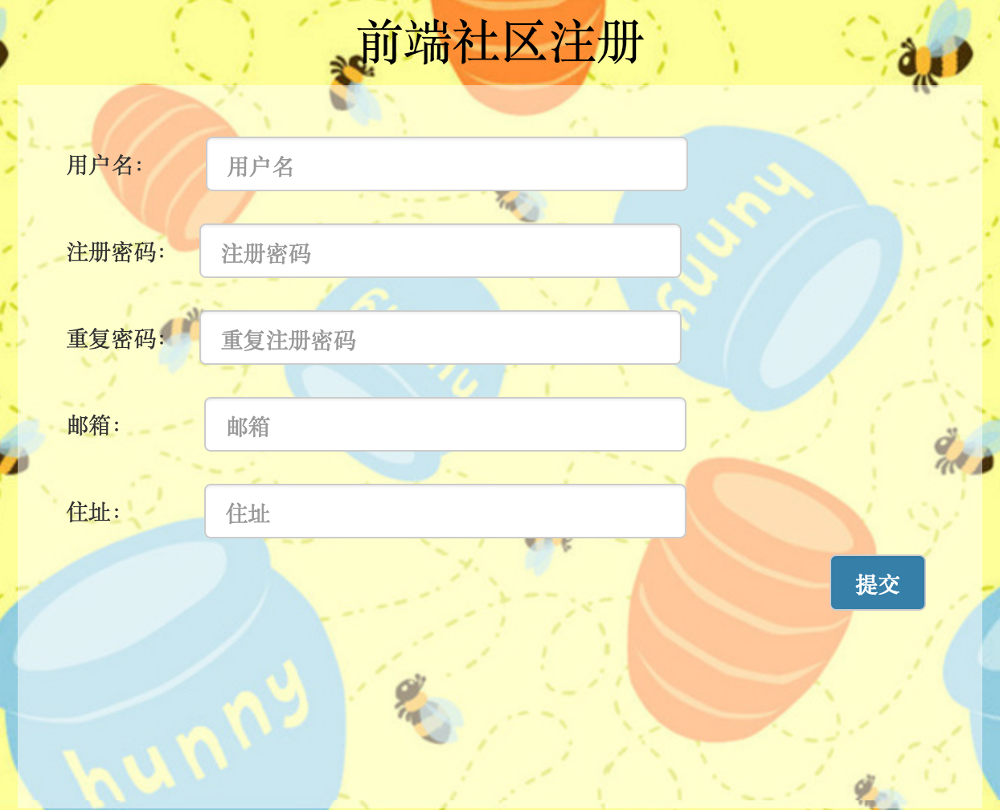


## 用户登录
1. 用户填写用户名与登录密码
2. 通过登录按钮，触发登录相关的ajax函数获取值
3. 在当前登录页面下，通过post方法，调用findUser()函数  
	首先查找用户名是否存在，如果不存在这条记录，输出“用户名不存在”；  
	如果找到用户名，调出这条记录中的密码，与用户输入值比较，匹配成功进入博客界面  


## 查看权限设置
1. 在app.js中引用一个验证中间件authority.js  
2. 将isAuthorized属性，插入app.js中的路由分配函数中，只有isAuthorized属性值为true，才有权访问对应的路由文件。  
```
app.use('/',require('./routes/login'));
app.use('/yes',authority.isAuthenticated,require('./routes/index'));
app.use('/admin',authority.isAuthenticated,require('./routes/admin'));
```

#### authority.js原理
在用户登录时，服务器把用户信息保存到req.session.user属性中。  
如果用户未登录，req.session.user为undefined，isAuthorized属性输出为false。  


## 发布新闻
1. 用户在新建新闻界面，输入数据
2. 点击发布新闻按钮，调用ajax函数，获取当前页面的输入值
2. post方法调用addNews()函数，在News集合中录入一条新的记录，键/值对来源于ajax的获取数据。
  
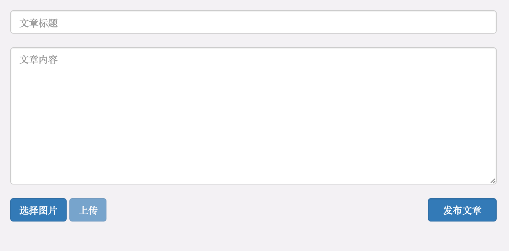


## 新闻列表

#### 非分页新闻列表
在新闻显示页调用查找新闻findNews函数
- find()方法查找News集合中的所有文档  
- 设定排序方式  
- 在新闻列表的hbs页面，用{{#each 数据数组}}的方式，循环渲染新闻简介  

#### 分页新闻列表
在新闻显示页调用查找新闻findNews函数  
- 添加页面跳转部分。上/下一页按钮的点击使url新增变量信息，用于储存当前所在的新闻页码，使得在后台代码可以用req.query.page获取跳转的页码值。  
- find函数使用skip方法跳过当前所在页之前的新闻，使用limit限定读取当前所在页的新闻条数  
- 用{{#each 数据数组}}在前端渲染查找到的文档数据  

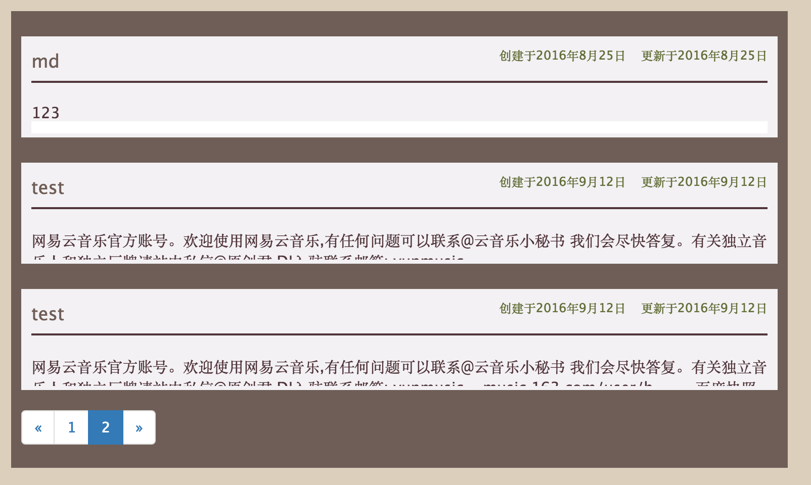

## 博客的markdown格式转换
使用插件，把需要渲染的部分data(正文内容)通过中间件渲染，再传入News集合中的新文档中去。  

####方法一：  
使用Remarkable，为了能够支持代码高亮，我们还用到了另外一个中间件highlight  
```js
var md = webHelper.Remarkable();  
 data.content = md.render(data.content);
```  

####方法二：  
使用markdown插件  
```js
var markdown = require('markdown').markdown;  
data.content = markdown.toHTML(data.content);
```  

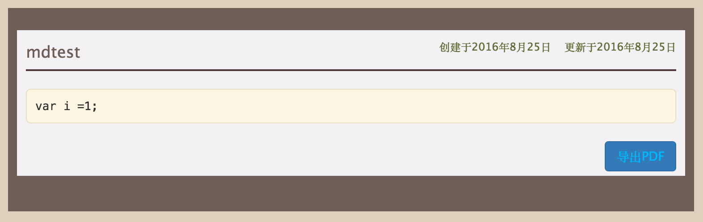

## 新闻中添加图片
1. 在添加新闻页面，引入上传文件控件，选择图片，文件会保存到上传空间的文件列表数组中去，图片文件保存在upload文件夹中
2. 点击按钮上传，触发上传图片的ajax函数，调用jquery的format函数，得到包含图片路径的插入图片的md语句，并插入新闻内容编辑区域。


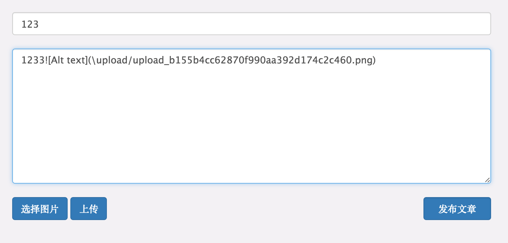


## 导出新闻到PDF
1. 在单条新闻页面，点击导出PDF按钮后，获取用来导出的页面的路由
2. post方法调用nodepdf中间件的渲染函数，渲染出包含导出pdf组件的导出页面。


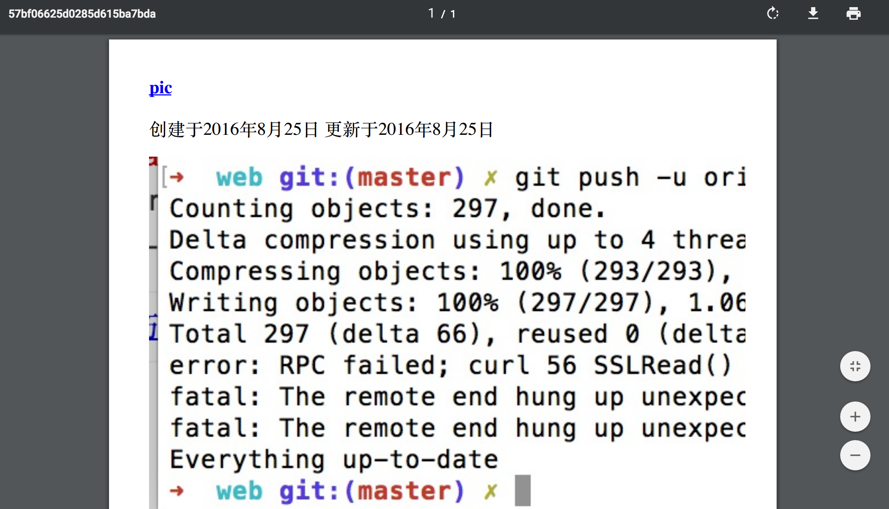


## 文章删除
1. 在新闻管理列表，调用findNews分页显示新闻标题、作者、创建时间等信息
2. 在每行新闻记录的行内，点击删除按钮时，this指针指向当前行对应的文档，获取_id值
3. post调用remove()函数，删除通过传入_id值的find函数返回到的文档 

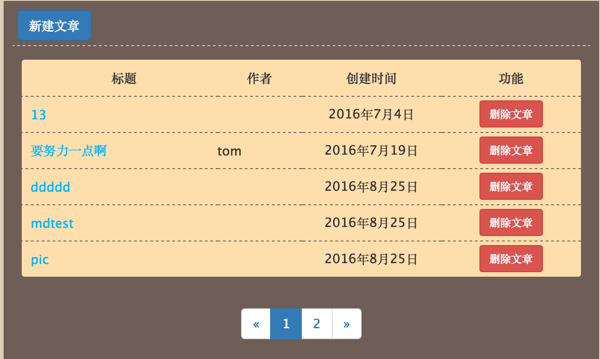


## 文章查询 
1. 以form表单action=''、method='get'方式获取搜索框内的关键字，并使用RegExp，来构建正则表达式对象，生成模糊字
2. 调用查找文章函数，以正则表达式对象为查找关键字，原理同新闻列表页面，并把data渲染到前台

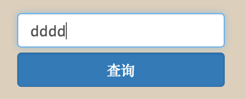
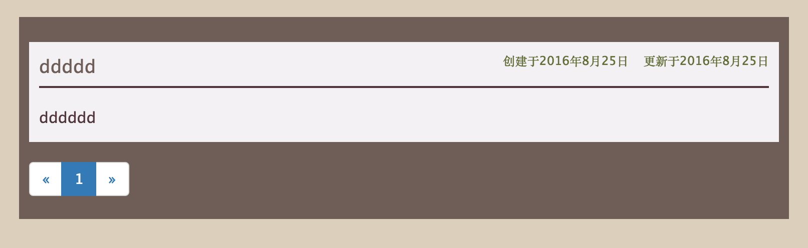


## 添加留言
1. 在打开该条新闻时，将新闻的_id存储到全局变量config.news.path
2. 点击发表评论，抓取前台页面信息储存
3. 以post方式处理页面路由时，调用添加评论函数，并把该新闻的_id通过全局变量的媒介存储到数据库中
4. 以get方式处理页面路由时，调用查找评论函数，以新闻的_id作为查找关键字，以each的方式传输到前台

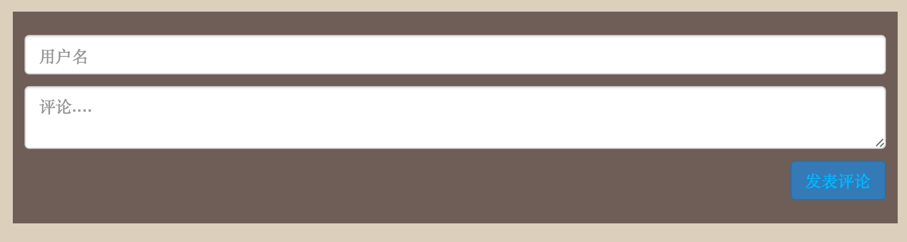
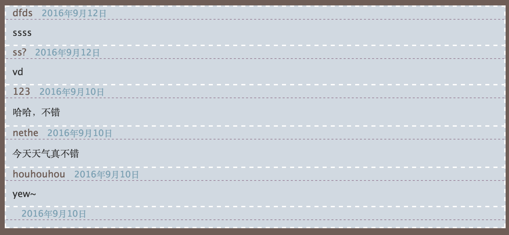

## 网页访问量统计
1. 借助数据库：每次测试提交一条记录，测试人数就是读取记录数来显示，涉及到插入和读取操作。
1. 新建一个用于存储游客记录的Schema，在用户完成登陆后，添加当前用户信息（从cookie和输入框的值中获取）作为一条新记录插入Visitor集合。
2. 在获取访问人数的页面，通过post方法调用Visitor集合中文档总数统计，并且输出到页面
3. 在前台页面获取访客记录数据。 


